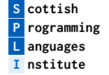

# Call For Sponsorship
## Scottish Programming Languages & Verification Summer School (SPLV) 2024
## 29 July -- 03 August 2024

Scotland is internationally renowned for its leading expertise in
programming language design,
implementation,
and
formal program verification.
Since 2019,
the [*Scottish Programming Languages and Verification Summer School*](https://scottish-pl-institute.github.io/splv/) (SPLV) has provided local and international students with foundational and advanced learning on topics in programming languages and verification research.
SPLV's core mission is to:

1. Provide essential research training for postgraduate students
2. Broaden participants' knowledge by exposing them to cutting edge research
3. Facilitate networking between students and established researchers
4. Foster the Scottish Programming Languages community

Each edition of SPLV has been well attended by local PhD students, as well as attracting international PhD students, academics, and industrial practitioners.

SPLV 2024 is organised by the University of Strathclyde, with support from the [Scottish Programming Languages Institute](https://scottish-pl-institute.github.io) (SPLI) and [Scottish Informatics and Computer Science Alliance](https://www.sicsa.ac.uk/) (SICSA).
The core theme of SPLV 2024 is *putting theory into practice*, enabling students to learn how cutting edge theoretical research can be applied to address practical software engineering problems.
Our courses cover a range of topics including type theory, category theory, protocol verification, and effect handlers.

The SPLV 2024 Invited Lecturer is [Dr. Lindsey Kuper](https://users.soe.ucsc.edu/~lkuper/),
Assistant Professor at the University of California Santa Cruz.
Dr. Kuper's research draws on the research traditions of programming languages, distributed systems, and software verification.
Specifically, Dr. Kuper uses programming-language-based approaches to build concurrent and distributed software systems that are elegant, correct, and efficient.

For more information about SPLV 2024,
please visit:

+ <https://scottish-pl-institute.github.io/splv/2024-strathclyde/>

By sponsoring SPLV,
your organisation will gain access to the SPLI/SICSA communities that contain experts at the cutting edge of programming languages and verification research.
Your organisation will have the chance to collaborate and engage with these communities, as well as access to the communities' postgraduate students.
The funds raised through your organisation's sponsorship will help us to reduce the participation costs for students.

# Contact

If your company would like to sponsor SPLV 2024 then please do get in contact with the organising team at:

+ <CIS_splv2024@groups.strath.ac.uk>

# Sponsorship Packages

<table>
<colgroup>
<col style="width: 10%" />
<col style="width: 40%" />
<col style="width: 10%" />
</colgroup>
<thead>
<tr class="header">
<th><strong>Package</strong></th>
<th><strong>Benefits</strong></th>
<th><strong>Contribution</strong></th>
</tr>
</thead>
<tbody>
<tr class="bronze">
<td class="detail">Bronze</td>
<td class="package">
Recognised sponsor for SPLV 2024.

<ul>
<li>Logo on Website</li>
<li>Mentioned in all School related communications</li>
<li>Introduction to SICSA and SPLI</li>
</ul></td>
<td class="detail">500.00 GBP</td>
</tr>
<tr class="silver">
<td class="detail">Silver</td>
<td class="package">
Bronze sponsorship <strong>and</strong>

<ul>
<li>Provide flyers to participants</li>
<li>1 complementary summer school registration</li>
<li>12 months of role advertisement through SICSA website</li>
</ul></td>
<td class="detail">1000.00 GBP</td>
</tr>
<tr class="gold">
<td class="detail">Gold</td>
<td class="package">
Silver sponsorship <strong>and</strong>

<ul>
<li>1 additional registration (2 total)</li>
<li>Address to school participants</li>
<li>Complementary stand at next SICSA Careers fair</li>
</ul></td>
<td class="detail">2000.00 GBP</td>
</tr>
<tr class="platinum">
<td class="detail">Platinum</td>
<td class="package">
Gold sponsorship <strong>and</strong>

<ul>
<li>Permanent stand during the School</li>
<li>2 additional registrations (4 total)</li>
<li>Attendance at the next SICSA PhD Conference</li>
</ul></td>
<td class="detail">4000.00 GBP</td>
</tr>
</tbody>
</table>

## Additional options:

Additional sponsorship options can include:

<table>
<colgroup>
<col style="width: 10%" />
<col style="width: 40%" />
</colgroup>
<tbody>
<tr>
<td class="detail"><strong>T-shirt Sponsor</strong></td>
<td class="package">You provide the Summer School T-shirt (with your logo on it) to
participants</td>
</tr>
<tr>
<td class="detail"><strong>Gift Sponsor</strong></td>
<td class="package">You provide Summer School mugs or notebooks (with your logo on
it)</td>
</tr>
</tbody>
</table>

# About SPLI

The [Scottish Programming Languages Institute](https://scottish-pl-institute.github.io) (SPLI) unites researchers in programming languages research from the Universities of Edinburgh, Glasgow, Heriot-Watt, St Andrews, Stirling, Strathclyde, and West of Scotland.
Together,
the SPLI Community co-ordinates events across Scotland which enhance programming languages research and knowledge exchange.

# About SICSA

The [Scottish Informatics and Computer Science Alliance](https://www.sicsa.ac.uk) (SICSA) is a collaboration of 14 Scottish
Universities.
SICSA promotes international excellence in University-led research, education, and
knowledge exchange for Scottish Informatics and Computer Science.
Each year SICSA organises the annual SICSA PhD Conference, a showcase event, attended by more than 150
research students drawn from across computing schools and departments within all 14 of
Scotland’s higher education institutions.
