---

title: SPLV 2024
custom_css:
 - strath
 - pure-min
 - grids-responsive-min

speciala: Vikraman&nbsp;MC319 | Andrés&nbsp;MC301
specialb: Bob&nbsp;MC301 | Sam&nbsp;MC319
specialc: Kathrin&nbsp;MC301 | Jules&nbsp;MC319
core1: Conor&nbsp;MC301
core2: Chris&nbsp;MC301
invited: Jean-Marie&nbsp;MC301
lightning: <a href="lightning.html">Lightning</a>
---

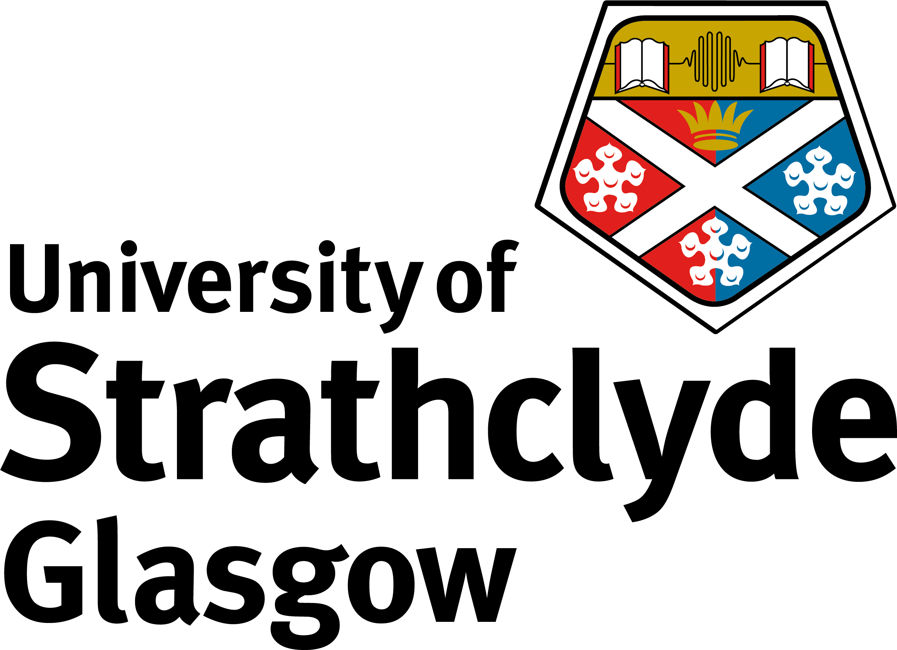

# SPLV24: Scottish Programming Languages and Verification Summer School, 2024

## University of Strathclyde, [Glasgow, UK](https://www.yr.no/en/forecast/daily-table/2-2648579/) — July 29th to August 2nd



This year, the [Scottish Programming Languages and Verification Summer School](..)
will be held at the University of Strathclyde campus **in the [McCance Building](https://maps.app.goo.gl/dRV3M6xkEbPh69id7), 16 Richmond Street, G1 1XQ**.
The event is organized by the [Mathematically Structured Programming group](https://msp.cis.strath.ac.uk) in the [Department of Computer and Information Sciences](https://www.strath.ac.uk/science/computerinformationsciences/).

For announcements and updates concerning SPLV 2024, please subscribe to our [SPLS Zulip stream](https://spls.zulipchat.com/#narrow/stream/402733-splv-2024).

## Schedule

All talks will take place on level 3 of the [McCance Building](https://maps.app.goo.gl/dRV3M6xkEbPh69id7) (follow the signs from the building entrance at 16 Richmond street).
The invited and core courses will take place in room MC301. The specialised courses will take place in rooms MC301 and MC319.

 <table>
  <tr>
    <th class="time"></th>
    <th class="weekday">Monday</th>
    <th class="weekday">Tuesday</th>
    <th class="weekday">Wednesday</th>
    <th class="weekday">Thursday</th>
    <th class="weekday">Friday</th>
  </tr>
  <tr>
    <td class="time">08:30</td>
    <td class="registration"></td>
    <td class="breakfast"></td>
    <td rowspan=3 class="freetime"></td>
    <td class="breakfast"></td>
    <td class="breakfast"></td>
  </tr>
  <tr>
    <td class="time">09:00</td>
    <td rowspan=3 class="core1">{{page.core1}}</td>
    <td rowspan=2 class="core2">{{page.core2}}</td>
    <td rowspan=2 class="speciala">{{page.speciala}}</td>
    <td rowspan=2 class="specialb">{{page.specialb}}</td>
  </tr>
  <tr>
    <td class="time">09:30</td>
  </tr>
  <tr>
    <td class="time">10:00</td>
    <td rowspan=2 class="core1">{{page.core1}}</td>
    <td class="breakfast"></td>
    <td rowspan=2 class="specialc">{{page.specialc}}</td>
    <td rowspan=2 class="speciala">{{page.speciala}}</td>
  </tr>
  <tr>
    <td class="time">10:30</td>
    <td class="coffee"></td>
    <td rowspan=2 class="specialb">{{page.specialb}}</td>
  </tr>
  <tr>
    <td class="time">11:00</td>
    <td rowspan=3 class="core2">{{page.core2}}</td>
    <td class="coffee"></td>
    <td class="coffee"></td>
    <td class="coffee"></td>
  </tr>
  <tr>
    <td class="time">11:30</td>
    <td rowspan=2 class="invited">{{page.invited}}</td>
    <td rowspan=2 class="invited">{{page.invited}}</td>
    <td rowspan=2 class="invited">{{page.invited}}</td>
    <td rowspan=2 class="invited">{{page.invited}}</td>
  </tr>
  <tr>
    <td class="time">12:00</td>
  </tr>
  <tr>
    <td class="time">12:30</td>
    <td rowspan=2 class="lunch"></td>
    <td rowspan=2 class="lunch"></td>
    <td rowspan=10 class="excursion"></td>
    <td rowspan=2 class="lunch"></td>
    <td rowspan=2 class="lunch"></td>
  </tr>
  <tr>
    <td class="time">13:00</td>
  </tr>
  <tr>
    <td class="time">13:30</td>
    <td rowspan=3 class="core1">{{page.core1}}</td>
    <td rowspan=2 class="speciala">{{page.speciala}}</td>
    <td rowspan=2 class="specialb">{{page.specialb}}</td>
    <td rowspan=2 class="specialc">{{page.specialc}}</td>
  </tr>
  <tr>
    <td class="time">14:00</td>
  </tr>
  <tr>
    <td class="time">14:30</td>
    <td rowspan=2 class="specialb">{{page.specialb}}</td>
    <td rowspan=2 class="specialc">{{page.specialc}}</td>
    <td class="farewell"></td>
  </tr>
  <tr>
    <td class="time">15:00</td>
    <td class="coffee"></td>
    <td rowspan=12 class="freetime"></td>
  </tr>
  <tr>
    <td class="time">15:30</td>
    <td rowspan=3 class="core2">{{page.core2}}</td>
    <td class="coffee"></td>
    <td class="coffee"></td>
  </tr>
  <tr>
    <td class="time">16:00</td>
    <td rowspan=2 class="specialc">{{page.specialc}}</td>
    <td rowspan=2 class="speciala">{{page.speciala}}</td>
  </tr>
  <tr>
    <td class="time">16:30</td>
  </tr>
  <tr>
    <td class="time">17:00</td>
    <td class="lightning">{{page.lightning}}</td>
    <td class="lightning">{{page.lightning}}</td>
    <td rowspan=8 class="freetime"></td>
  </tr>
  <tr>
    <td class="time">17:30</td>
    <td rowspan=4 class="social"></td>
    <td rowspan=3 class="freetime"></td>
    <td rowspan=7 class="freetime"></td>
  </tr>
  <tr>
    <td class="time">18:00</td>
  </tr>
  <tr>
    <td class="time">18:30</td>
  </tr>
  <tr>
    <td class="time">19:00</td>
    <td rowspan=4 class="dinner"></td>
  </tr>
  <tr>
    <td class="time">19:30</td>
    <td rowspan=3 class="freetime"></td>
  </tr>
  <tr>
    <td class="time">20:00</td>
  </tr>
  <tr>
    <td class="time">20:30</td>
  </tr>
</table>

## Core Courses

These required lectures cover foundational knowledge.

  **Category Theory**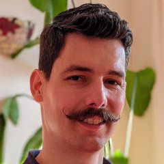
  : **Lecturer:** [Chris Heunen](https://homepages.inf.ed.ac.uk/cheunen/)

    **Slides:** [Monday and Tuesday combined](assets/slides/chris.pdf)
  : 

    
Abstract

      Category theory is a powerful way to describe objects only in terms of how they interact &mdash;
      without looking inside an object to see how it is made. In other words, it focuses on behaviour
      rather than implementation details. This tool is therefore very useful to think about programming
      languages and semantics, and relates to type theory. These lectures will start from the beginning,
      introducing categories and examples. We'll discuss universal properties, which characterise for
      example products and function types. Next we focus on monads, which are a popular way to capture
      computational effects, and adjunctions, which provide translations between different categories.
      Finally, we briefly touch on monoidal categories, string diagrams, and strong monads.
    

  {: .flex-element }

  **Type Theory**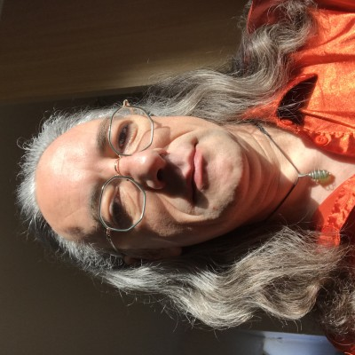
  : **Lecturer:** [Conor Mc Bride](https://personal.cis.strath.ac.uk/conor.mcbride/)

    **Slides:** [Document camera scans](assets/slides/conor.pdf), [Agda code](https://github.com/pigworker/TypesWhoSayNi/tree/master/spls)
  : 

    
Abstract

      What makes type theories tick? I intend these lectures to communicate an approach to the
      metatheory of type theories which keeps a tight grip on the direction of information flow
      and of trust. A typing rule is a server for its conclusion and a client for its premises.
      The places in judgement forms are classified not only grammatically but as signals.
      Every signal has both a sender (who transmits the syntax of the signal) and a guarantor
      (who promises that the signal is in some way meaningful). We gain insight by distinguishing
      inputs (client-sent) from outputs (server-sent), citizens (guaranteed by their senders)
      from subjects (to be guaranteed by their receivers), and expressions (synthesizing signals
      to send) from patterns (analysing signals upon receipt). In my first lecture, I shall
      introduce the approach via a straightforward example: a reformulation of Martin-Löf's
      1971 type theory, separating type checking for introduction forms from type synthesis
      for elimination forms. In my second lecture, I shall explore the metametatheory of the
      approach, showing generic benefits of its adoption, with some standard metatheoretic
      properties shifting becoming less things to prove and more things to not mess up.
      If I'm not massively overrunning by Tuesday morning, I'll have a quick look at how I
      go about formalising this approach in Agda. You won't find any of this in a book.
    

  {: .flex-element }

## Invited Course

Our guest lecture series opens a window to a related field.

**Introduction to Separation Logic**
: **Invited Lecturer:** [Jean-Marie Madiot](https://madiot.fr/)

  **Slides:** [Tuesday](assets/slides/jean-marie-1.pdf)
: 

    
Abstract

  

Unfortunately our original invited course had to be cancelled due to
Covid, and was replaced by the course above.

Cancelled course details

**A few ideas from distributed systems for PL folk**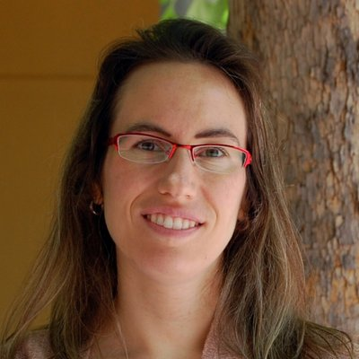
: **Invited Lecturer:** [Lindsey Kuper](https://users.soe.ucsc.edu/~lkuper/)
: 

    
Abstract

    Fifteen years ago, when I was a new PhD student and suffering from an
    advanced case of PL myopia, I foolishly ignored every other area of
    computer science. It was only years later that I realized that distributed
    systems had a lot to teach me.  In these lectures, I'll fill you in on what
    I've learned so far, so you won't be as foolish as I was. We'll start with
    the very basics (what is a distributed system?) and work our way up to an
    implementation of causal broadcast, then finish the week with a brief
    excursion into choreographic programming.  No background in distributed
    systems is necessary, only an open mind.
  

: 

    
Bio

    Lindsey Kuper is an Assistant Professor at the University of California,
    Santa Cruz.  She works on programming-language-based approaches to building
    concurrent and distributed software systems that are elegant, correct, and
    efficient. Some of her research contributions include library-level
    choreographic programming, verification of distributed protocols using
    refinement types, and guaranteed-deterministic parallel programming with
    LVars. She co-founded !!Con
    (<a href="https://bangbangcon.com">bangbangcon.com</a>), the radically
    inclusive conference of ten-minute talks on the joy, excitement, and
    surprise of computing.  She is the recipient of an ICFP Distinguished
    Paper Award (2023), an NSF CAREER Award (2022), and a Google Faculty
    Research Award (2019), and received her Ph.D. in computer science in 2015
    from Indiana University.
  

## Specialised Courses

The specialised courses are offered as two tracks running in parallel.

### Track 1
{: .flex-element }

**Type Theory & Implicit Complexity**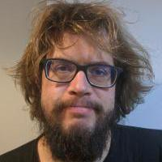
: **Lecturer:** [Bob Atkey](https://bentnib.org/)

  **Slides:** [Tuesday](assets/slides/bob-1.pdf), [Wednesday](assets/slides/bob-2.pdf)
: 

    
Abstract

    Implicit Computational Complexity is concerned with the
    characterisation of computational complexity classes as programming
    languages. A programming language characterises a complexity class if
    every function in that class can be implemented in the language and
    every function implementable in the language is in the class.

    In this course I will show how to use Linear Type Theory to
    characterise the class of Polynomial Time computable functions, and
    how by using Linear Dependent Types, we can use this describe other
    classes such as NP, coNP and beyond.
  

**Mechanization of Binders**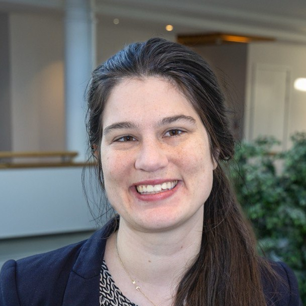
: **Lecturer:** [Kathrin Stark](https://www.k-stark.de/)
: 

    
Abstract

    Binders are ubiquitous when mechanising results about programming languages.
    More than 15 years after the POPLMark Challenge, new tools and approaches
    to binding are still being published, and binders are still frequently
    mentioned as being the main difference between mechanisation and paper proof.
    So which one to choose: named, de Bruijn, locally nameless, nominal syntax
    or HOAS? While not answering this question, this course takes a (necessarily
    incomplete) peek into several approaches to binders in a programming language,
    with a focus on their mechanisation.
  

**Category Theory for Semantics**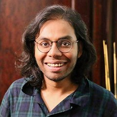
: **Lecturer:** [Vikraman Choudhury](https://vikraman.org/)
: 

    
Abstract

      A programming language is a very exotic object: it provides a vocabulary
      to give instructions to a computer, and at the same time, denotes a mathematical
      object that follows axioms. The purpose of semantics is to reconcile the two
      notions, giving insights into computation, language design, and programming.
      In this course, I will introduce some tools and techniques from category
      theory that are useful to semanticists, and show applications of these to
      prove fundamental results about type theories and programming languages.
  

### Track 2

**Protocol Verification**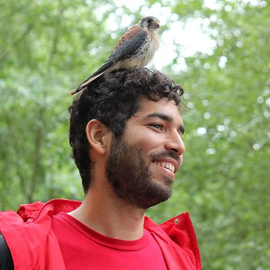
: **Lecturer:** [Andrés Goens](https://goens.org/)

  **Slides:** [Tuesday (still with some typos)](assets/slides/andres-1.pdf)
: 

    
Abstract

    Protocols are central to the functioning of many crucial systems. From
    the consistency of your device's memory, to exchanging information over
    the internet, protocols ensure these extremely concurrent systems
    function correctly. In this course we will consider some basic
    principles required to verify such protocols. We will learn about
    labeled transition systems and use temporal logic to specify properties
    of them. In particular, we will focus on safetey and fairness conditions
    in protocols.
  

**Effects and Handlers**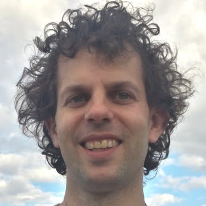
: **Lecturer:** [Sam Lindley](https://homepages.inf.ed.ac.uk/slindley/)

  **Slides:** [Monday](assets/slides/sam-1.pdf), [Wednesday](assets/slides/sam-2.pdf)
: 

    
Abstract

      Effect handlers allow programmers to define, customise, and compose a
      range of crucial programming features ranging from exceptions to
      lightweight threads to probability, inside the programming language.
      In this course I will give a high-level introduction to the theory of
      algebraic effects and effect handlers, effect type systems for effect
      handlers, and effect handler oriented programming.
  

**Applied Category Theory**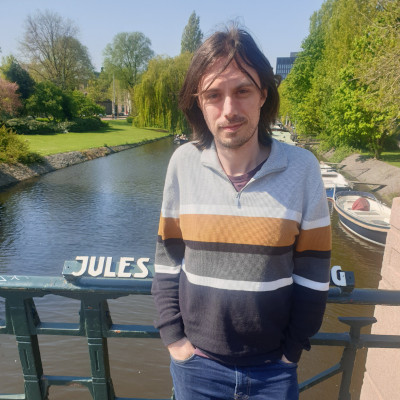
: **Lecturer:** [Jules Hedges](https://julesh.com/)
: 

    
Abstract

    This course will be about symmetric monoidal categories and what they have to tell us about computation and systems. I plan the topics of my 4 lectures to be:
    <ol>
      <li> string diagrams as 2-dimensional syntax, how they unify computation graphs and flowcharts</li>
      <li> traced, compact closed and hypergraph categories, non-well-founded recursion, backtracking and quantum processes</li>
      <li> decorated and structured cospans, the standard sledgehammer for building domain-specific categories of open systems</li>
      <li> bidirectional processes: lenses, optics, containers, differentiable programming, categorical cybernetics</li>
    </ol>
  

## Prerequisites

The school is aimed at PhD students in programming languages, verification and related areas.
Researchers and practitioners are very welcome, as are strong undergraduate and masters students with the support of a supervisor.
Participants will need to have a background in computer science, mathematics or a related discipline, and have basic familiarity with (functional) programming and logic.

## Lightning talks

We will have two lightning talk sessions at the end of Monday and Tuesday for students to give a quick introduction to their research. More information including the schedule and talk titles [here](lightning.md).

## Evening activities and excursion

On Monday evening, after the lightning talks, we will have a social event with free pizza and drinks. This will take place on level 11 of Livingstone Tower, next door to the McCance building, with views over Glasgow.

On Tuesday evening, we will have the summer school dinner in [Madha](https://www.madha.co.uk/) in the Merchant City part of Glasgow. Food and reasonable drink is included in your registration.

On Wednesday afternoon, we will take a local train to Pollok Country Park (train station: Pollokshaws West), which is on the outskirts of Glasgow. There is the opportunity to go for a walk in the park (and watch the highland cattle!), admire the formal gardens of Pollok House, or visit [the Burrell Collection](https://burrellcollection.com/) (free entry), an award-winning art museum.

## Covid mitigation

If you can, please take a Covid test before attending the school, and obviously do not attend if you are not feeling well. Feel free to wear a mask during lectures, if you want -- some FFP2 masks will be available for anyone that wants them.

## Travel and Accommodation

The University of Strathclyde is located a short (five minutes) walk from Glasgow Queen Street, heading east from the City Centre. Glasgow Central Station is 15 minutes away.
The University provides [travel information](https://www.strath.ac.uk/maps/) including maps and directions.
Lectures will take place on the third floor of the [McCance Building](https://maps.app.goo.gl/dRV3M6xkEbPh69id7) on the University of Strathclyde campus. There will be signs directing you from the entrance of the building, which is on the north side of the building, on Richmond Street.

There are many hotels in and around the city centre, as well as some hostels.

The very nearest hotels to the university are:
* Premier Inn George Square (100m)
* Moxy Merchant City (250m)
* Z Hotel Glasgow (300m)
* AC Hotel by Mariott Glasgow (300m)

The Premier Inns at St Enoch Square and particularly Glasgow City Centre South (just south of the River Clyde), are a bit further away (~25 min walk for the latter), but are normally cheaper than their George Square counterpart.

For those willing to share a dorm, the Revolver Hotel (private rooms also available) may be worth a look.

Unfortunately, Strathclyde's halls of residence are not available this summer due to renovation work.
However for those who would prefer a cheap self-catering option, we understand that our city-centre neighbour, Glasgow Caledonian University, currently has availability (~15 minute walk).
You would have to email their [accommodation office](mailto:accommodation@gcu.ac.uk) for more information.

## Sponsors

The summer school is generously [sponsored](call-for/sponsorship/) by the Scottish Informatics and Computer Science Alliance, Quantinuum, Well-Typed, and Tweag.

### Gold

### Bronze

<a href="https://www.well-typed.com/">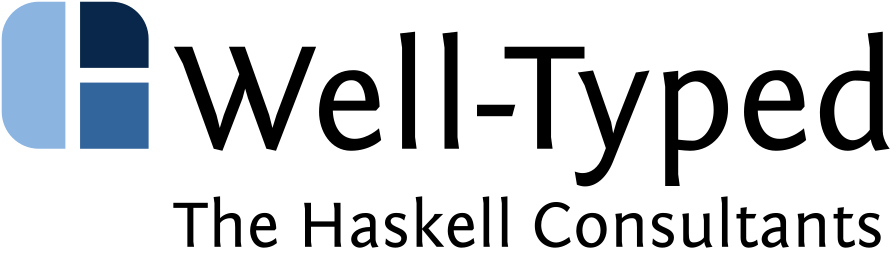 </a>

## Registration

Registration closed Sunday 14 July.

The registration fees are:

**Free**
:   for students at a SICSA-affiliated university (limited places)

**250.00 GBP**
:   for students at non SICSA-affiliated universities and academics

**750.00 GBP**
:   for all other participants, i.e. industry practitioners and independent researchers

For students and academics, we kindly request that you register with an institutional account.

If you are unsure which fee is applicable to you, please do get in contact.

Fees cover: all lecture courses, tea and coffee breaks, lunch, a social event on Monday evening, and conference dinner Tuesday evening.

Fees **do not** cover: travel and accommodation nor subsistence outside of the Summer School times.
A list of options for accommodation are provided below.

## Further Information

If you have any further questions please get in contact with the local organising team at:

+ <CIS_splv2024@groups.strath.ac.uk>

The principal organisers of SPLV24 are:

* Guillaume Allais <guillaume.allais@strath.ac.uk>
* Fredrik Nordvall Forsberg <fredrik.nordvall-forsberg@strath.ac.uk>
* Jan de Muijnck-Hughes <jan.de-muijnck-hughes@strath.ac.uk>
* Sean Watters <sean.watters@strath.ac.uk>
