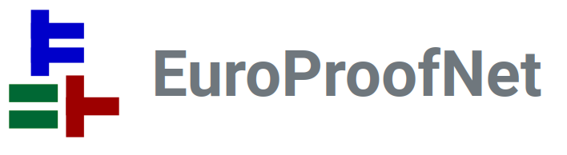

---

title: SPLV 2025
custom_css:
 - edinburgh

---

# SPLV25: Scottish Programming Languages and Verification Summer School 2025

## The University of Edinburgh --- Monday 21st to Friday 25th July 2025

For SPLV 2025 announcements and updates, subscribe to our [SPLS Zulip
stream](https://spls.zulipchat.com/#narrow/stream/481612-splv-2025).

**Standard registration is open until the 25th of June!** ([see below](#registration))

## Schedule

The School takes place in the following locations:

- The Anatomy Lecture Theatre (ALT), Room 1.425 at the Old Medical School, Doorway 3, Teviot Pl, Edinburgh EH8 9AG
- The Meadows Lecture Theatre (MLT), Room G.07 at the Old Medical School, Doorway 4, Teviot Pl, Edinburgh EH8 9AG
- The Informatics Forum (INF), Room G.07, 10 Crichton Street, Edinburgh EH8 9AB

 <table>
  <tr>
    <th class="time"></th>
    <th class="weekday">Monday</th>
    <th class="weekday">Tuesday</th>
    <th class="weekday">Wednesday</th>
    <th class="weekday">Thursday</th>
    <th class="weekday">Friday</th>
  </tr>
  <tr>
    <td class="time">09:00</td>
    <td class="registration">Registration&nbsp;ALT</td>
    <td rowspan=3>Edwin&nbsp;ALT</td>
    <td rowspan=3>Robbert&nbsp;ALT</td>
    <td rowspan=3>Perdita&nbsp;MLT</td>
    <td rowspan=3>Lindsey&nbsp;INF</td>
  </tr>
  <tr>
    <td class="time">09:30</td>
    <td rowspan=3>Rob&nbsp;ALT</td>
  </tr>
  <tr>
    <td class="time">10:00</td>
  </tr>
  <tr>
    <td class="time">10:30</td>
    <td class="coffee">Coffee&nbsp;ALT</td>
    <td class="coffee">Coffee&nbsp;ALT</td>
    <td class="coffee">Coffee&nbsp;ALT</td>
    <td class="coffee">Coffee&nbsp;INF</td>
  </tr>
  <tr>
    <td class="time">11:00</td>
    <td class="coffee">Coffee&nbsp;ALT</td>
    <td rowspan=3>Perdita&nbsp;ALT</td>
    <td rowspan=3>Lindsey&nbsp;ALT</td>
    <td rowspan=3>Rob&nbsp;ALT | Fred&nbsp;MLT</td>
    <td rowspan=3>Robbert&nbsp;INF</td>
  </tr>
  <tr>
    <td class="time">11:30</td>
    <td rowspan=3>Fred&nbsp;ALT</td>
  </tr>
  <tr>
    <td class="time">12:00</td>
  </tr>
  <tr>
    <td class="time">12:30</td>
    <td rowspan=3 class="lunch">Lunch&nbsp;ALT</td>
    <td rowspan=3 class="lunch">Lunch&nbsp;ALT</td>
    <td rowspan=3 class="lunch">Lunch&nbsp;ALT</td>
    <td rowspan=3 class="lunch">Lunch&nbsp;INF</td>
  </tr>
  <tr>
    <td class="time">13:00</td>
    <td rowspan=2 class="lunch">Lunch&nbsp;ALT</td>
  </tr>
  <tr>
    <td class="time">13:30</td>
  </tr>
  <tr>
    <td class="time">14:00</td>
     <td rowspan=3>Robbert&nbsp;ALT</td>
     <td rowspan=3>Rob&nbsp;ALT | Fred&nbsp;MLT</td>
     <td rowspan=10 class="excursion"></td>
     <td rowspan=3>Filip&nbsp;ALT</td>
     <td rowspan=3>Edwin&nbsp;INF</td>
  </tr>
  <tr>
    <td class="time">14:30</td>
  </tr>
  <tr>
    <td class="time">15:00</td>
  </tr>
  <tr>
    <td class="time">15:30</td>
    <td class="coffee">Coffee&nbsp;ALT</td>
    <td class="coffee">Coffee&nbsp;ALT</td>
    <td class="coffee">Coffee&nbsp;ALT</td>
    <td rowspan=13 class="freetime"></td>
  </tr>
  <tr>
    <td class="time">16:00</td>
    <td rowspan=3>Lindsey&nbsp;MLT</td>
    <td rowspan=3>Filip&nbsp;MLT</td>
    <td rowspan=3>Mentoring Event&nbsp;MLT</td>
  </tr>
  <tr>
    <td class="time">16:30</td>
  </tr>
  <tr>
    <td class="time">17:00</td>
  </tr>
  <tr>
    <td class="time">17:30</td>
    <td rowspan=4 class="social">Social&nbsp;INF</td>
    <td rowspan=9 class="freetime"></td>
    <td rowspan=9 class="freetime"></td>
  </tr>
  <tr>
    <td class="time">18:00</td>
  </tr>
  <tr>
    <td class="time">18:30</td>
  </tr>
  <tr>
    <td class="time">19:00</td>
    <td rowspan=6 class="dinner">Dinner</td>
  </tr>
  <tr>
    <td class="time">19:30</td>
    <td rowspan=5 class="freetime"></td>
  </tr>
  <tr>
    <td class="time">20:00</td>
  </tr>
  <tr>
    <td class="time">20:30</td>
  </tr>
  <tr>
    <td class="time">21:00</td>
  </tr>
  <tr>
    <td class="time">21:30</td>
  </tr>
</table>

## Courses

**Program verification using concurrent separation logic** (guest course)

: **Guest Lecturer:** [Robbert Krebbers](https://robbertkrebbers.nl/), Radboud
  University Nijmegen

: 
 
Abstract

	Concurrent programs are challenging to get right, especially if threads
    share access to memory. The formalism of "concurrent separation Logic"
    (which was pioneered by O'Hearn and Brookes in 2007) provides a powerful
    framework to verify concurrent programs. Over the last 20 years, concurrent
    separation Logic has emerged into an active research field, has been
    extended with many features (e.g., fine-grained concurrency, weak memory
    consistency, higher-order programs), been applied to many programming
    languages (e.g., Rust), and has been implemented in numerous verification
    tools (e.g., F*, Iris, Verifast, Viper, VST). We will discuss the
    foundations of separation logic and show how they scale to the verification
    of challenging concurrent programs. Exercises and demos using the Iris
	framework in the Rocq proof assistant will be provided.
    

**A few ideas from distributed systems for PL folk** (guest course)

: **Guest Lecturer:** [Lindsey Kuper](https://users.soe.ucsc.edu/~lkuper/),
  University of California, Santa Cruz

: 

	
Abstract

	Fifteen years ago, when I was a new PhD student and suffering from an
    advanced case of PL myopia, I foolishly ignored every other area of computer
    science. It was only years later that I realized that distributed systems
    had a lot to teach me. In these lectures, I'll fill you in on what I've
    learned so far, so you won't be as foolish as I was. We'll start with the
    very basics (what is a distributed system?) and work our way up to an
    implementation of causal broadcast, then finish the week with a brief
    excursion into choreographic programming. No background in distributed
    systems is necessary, only an open mind.
	

**Core Course: Type theory**

: **Lecturer:** [Fredrik Nordvall Forsberg](https://fredriknf.com/), University
  of Strathclyde

: 

	
Abstract

	Type theory is both a foundation of mathematics and an expressive functional
    programming language, and the basis of proof assistants and programming
    languages such as Agda, Idris, Rocq, and Lean. There are many aspects to
    type theory, and these lectures will give an introduction to three of them:
    (i) what it is, and how to work in it (the user's perspective); (ii)
    studying type theory as a formal system, and proving properties such as
    normalisation, canonicity, and subject reduction (the metatheorist's
    perspective); and (iii) models of type theory, and how they suggest new
    axioms, as well as let us conveniently manipulate mathematical structures of
    interest (the semanticist's perspective).
	

**Core Course: Concurrency theory**

: **Lecturer:** [Rob van Glabbeek](http://theory.stanford.edu/~rvg/), University
  of Edinburgh

: 

    
Abstract

	This course aims to make students familiar with state-of-the-art techniques
	in modelling concurrent systems. This is done by comparing some of the more
	successful semantic models of concurrency found in the literature, including
	transition systems, Petri nets and process algebras. The focus will be on
	the rationale behind the design decisions underlying those models, viewed
	from philosophical, mathematical and computational perspectives. A central
	concept will be that of a semantic equivalence or preorder, relating system
	specifications and implementations.
    

**Application programming with dependent types**

: **Lecturer:** [Edwin Brady](https://www.type-driven.org.uk/edwinb/),
  University of St Andrews

: 

    
Abstract

    TBD
    

**Logical relations for program equivalence**

: **Lecturer:** [Filip Sieczkowski](https://fsieczkowski.github.io/),
  Heriot-Watt University

: 

    
Abstract

	In this course we will explore logical relations, as a classic type-based
    method of proving equivalence of programs and, crucially, program
    fragments. We will introduce the problem of program (fragment) equivalence
    and solve it in the setting of simply-typed lambda calculus, and proceed to
    extend the method to some of the features found in modern programming
    languages, including polymorphism, recursion in types and terms, and
    computational effects, ending with a look at extending the methodology to
    type-and-effect systems.
    

**Models, programs and bidirectional transformations**

: **Lecturer:** [Perdita Stevens](https://perditastevens.com/), University of
  Edinburgh

: 

    
Abstract

	Historically there has - surprisingly, perhaps - been something of a gulf
    between the programming languages and software engineering communities,
    which I will argue has been to the detriment of both. One of the many places
    this shows up is in the fields' treatments of bidirectional transformations,
    by which I mean, automated means of checking and restoring appropriate
    notions of consistency between data sources. I will introduce this topic
    from a software engineering perspective, which will necessitate introducing
    modelling and model-driven engineering more generally. I will briefly wave
    at the treatment of the topic in the functional programming community, via
    optics. I will opine about some open problems and some things I think the
    next generation of researchers should pay attention to, in order to narrow
    rather than widen the gulf between PL and SE, to the benefit of both.

Unfortunately, Simon Fowler is unable to join us and had to cancel his course.

Cancelled course details

**Behavioural types**

: **Lecturer:** [Simon Fowler](https://simonjf.com/about/), University of
  Glasgow
: 

	
Abstract

	Much like data types allow us to rule out common programming errors before
    we compile or run a program, behavioural type systems provide a lightweight
    way of checking the correctness of behavioural properties of programs. Three
    examples include typestate, which allows us to ensure that we call object
    methods in the correct order (e.g. opening a file handle for reading before
    performing read operations and eventually closing the handle); session
    types, which allow us to check that a communication follows a protocol; and
    mailbox types, which allow us to specify patterns of messages received in
    many-to-one communication. This course will give an overview of behavioural
    typing, going into depth on the theoretical and practical aspects of session
    types and mailbox types.

## Prerequisites

The school is aimed at PhD students in programming languages, verification and
related areas. Researchers and practitioners are welcome, as are strong
undergraduate and masters students with the support of a
supervisor. Participants will need to have a background in computer science,
mathematics or a related discipline, and have basic familiarity with
(functional) programming and logic.

## Registration

Application for early registration as well as scholarships and subsidised
accommodation is now closed.

Standard registration is through the Edinburgh [online
shop](https://www.epay.ed.ac.uk/conferences-and-events/college-of-science-and-engineering/school-of-informatics/informatics-events/scottish-programming-languages-and-verification-summer-school-2025)
until the **25th of June**:

- *A. Academic rate Standard* for students and academic staff.
- *B. Full rate Standard* otherwise.

  <table>
	<tr>
      <th></th>
	  <th>Standard registration</th>
	</tr>
	<tr>
	  <th>Academic rate</th>
	  <th>£350</th>
	</tr>
	<tr>
	  <th>Full rate</th>
	  <th>£850</th>
	</tr>
  </table>

## Sponsors

### Gold & EDI Sponsors

### Silver & EDI Sponsor

### Bronze & EDI Sponsor

### Bronze Sponsors

### EDI Sponsor

## Application

Application for early registration as well as scholarships and accommodation is now closed.

#### Subsidised accommodation

Applicants can register interest in a room in [subsidised accommodation](#accommodation) for the week.

#### Scholarships

Applicants can apply for a scholarship, which we encourage all students and members of underrepresented groups to do. Scholarships cover registration for the summer school.

#### Deadline

The submission deadline for the application form is **30th April 2025**. We will send out confirmations of scholarships and subsidised accommodation by the 7th May 2025, when we will open up registration.

  <table>
	<tr>
      <th></th>
	  <th>Early registration</th>
	  <th>Standard registration</th>
	</tr>
	<tr>
	  <th>Academic rate</th>
	  <th>£250</th>
	  <th>£350</th>
	</tr>
	<tr>
	  <th>Full rate</th>
	  <th>£750</th>
	  <th>£850</th>
	</tr>
  </table>

The academic rate applies to students and staff at academic institutions.

If you do not fill in the application form by 30th April 2025 then you will still be able to register, but will not qualify for a scholarship, early registration rate, or subsidised accommodation.

#### EuroProofNet

Participants from Inclusiveness Target Countries* (ITC) can apply with
EuroProofNet for funding towards travel and accommodation. The reimbursement
rules can be found on the [EPN website](
https://europroofnet.github.io/reimbursement-rules/). To apply for a grant from
EuroProofNet for the transport and accommodation, please send an email to
[Frédéric Blanqui](https://blanqui.gitlabpages.inria.fr/) by the 30th of April
with:
- a short description of what you are doing and why you want to attend this school,
- an estimation of the cost of your transport in EUROS together with a screen
capture.
Notifications will be sent by the 7th of May.

(*) list of ITC countries: Albania, Armenia, Bosnia and Herzegovina, Bulgaria,
Croatia, Cyprus, Czech Republic, Estonia, Georgia, Greece, Hungary, Latvia,
Lithuania, Malta, Moldova, Montenegro, North Macedonia, Poland, Portugal,
Romania, Serbia, Slovakia, Slovenia, Turkey, Ukraine.

## Accommodation

Accommodation is not included in the registration fee.

We can offer a limited amount of subsidised accommodation to those who fill in the application form by 30th April 2025:

- Single room with shared kitchen and bathroom in a flat of 5 (all participants
  of SPLV) in student accommodation.

  Cost: £210 for 7 nights (Saturday 19th July--Saturday 26th July).

- Ensuite room with breakfast in a nearby hotel (owned by the University).

  Cost: £750 for 5 nights (Sunday 20th July--Friday 25th July) or
        £900 for 6 nights (Sunday 20th July--Saturday 26th July).

We cannot offer additional (or fewer) nights of accommodation. Confirmations may include the offer of a room in subsidised accommodation.

## Further Information

If you have any questions please contact the organisers at:

<splv-2025-organisers-group@uoe.onmicrosoft.com>

The organisers of SPLV25 are:

* Malin Altenmüller <malin.altenmuller@ed.ac.uk>
* Ohad Kammar <ohad.kammar@ed.ac.uk>
* Sam Lindley <sam.lindley@ed.ac.uk>
* Nachi Valliappan <nachi.v@ed.ac.uk>
