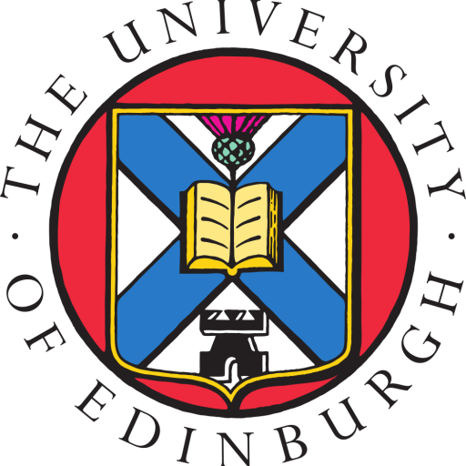

---

title: SPLV 2025
custom_css:
 - edinburgh
---

# SPLV25: Scottish Programming Languages and Verification Summer School 2025

## University of Edinburgh - 21st to 25th July

<!-- ## Core Courses

These required lectures cover foundational knowledge.

  **TBD**
  : **Lecturer:** TBD
  : 

    
Abstract

    TBD
    

  {: .flex-element }

  **TBD**
  : **Lecturer:** TBD
  : 

    
Abstract

    TBD
    

  {: .flex-element }

-->

## Invited Course

Our guest lecture series opens a window to a related field.

**Program verification using concurrent separation logic**

: **Invited Lecturer:** [Robbert Krebbers](https://robbertkrebbers.nl/)

<!--
: 

    
Abstract

    TBD
    

-->

**A few ideas from distributed systems for PL folk**

: **Invited Lecturer:** [Lindsey Kupers](https://users.soe.ucsc.edu/~lkuper/)

## Courses

In addition to the invited course, SPLV25 will offer core courses covering
foundational knowledge as well as specialised courses. Confirmed details will
appear here.

<!--
## Specialised Courses

TBD
-->
## Prerequisites

The school is aimed at PhD students in programming languages, verification and
related areas. Researchers and practitioners are very welcome, as are strong
undergraduate and masters students with the support of a supervisor.
Participants will need to have a background in computer science, mathematics or
a related discipline, and have basic familiarity with (functional) programming
and logic.

<!--
## Lightning talks

TBD

## Evening activities and excursion

TBD

## Travel and Accommodation

TBD

## Sponsors

TBD

## Registration

TBD
-->

## Sponsorship

We are currently seeking sponsorship for the school. If your company is
interested in supporting SPLV25, please get in touch with the organisers.

## Further Information

If you have any questions please get in contact with the local organising team
at:

<splv-2025-organisers-group@uoe.onmicrosoft.com>

The principal organisers of SPLV25 are:

* Malin Altenmüller <malin.altenmuller@ed.ac.uk>
* Ohad Kammar <ohad.kammar@ed.ac.uk>
* Sam Lindley <sam.lindley@ed.ac.uk>
* Nachi Valliappan <nachi.v@ed.ac.uk>
