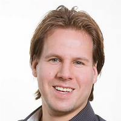

---

title: SPLV 2025
custom_css:
 - edinburgh
---

# SPLV25: Scottish Programming Languages and Verification Summer School 2025

## University of Edinburgh - 21st to 25th July

This year, the [Scottish Programming Languages and Verification Summer
School](https://spli.scot/splv/) will be held at The University of
Edinburgh.

For announcements and updates concerning SPLV 2025, please subscribe
to our [SPLS Zulip
stream](https://spls.zulipchat.com/#narrow/stream/481612-splv-2025).

## Courses

**Program verification using concurrent separation logic** (guest course)

: **Guest Lecturer:** [Robbert Krebbers](https://robbertkrebbers.nl/)

: 

    
Abstract

    TBD
    

**A few ideas from distributed systems for PL folk** (guest course)

: **Guest Lecturer:** [Lindsey Kuper](https://users.soe.ucsc.edu/~lkuper/)

: 

	
Abstract

	TBD
<!-- Fifteen years ago, when I was a new PhD student and suffering from an
    advanced case of PL myopia, I foolishly ignored every other area of computer
    science. It was only years later that I realized that distributed systems
    had a lot to teach me. In these lectures, I'll fill you in on what I've
    learned so far, so you won't be as foolish as I was. We'll start with the
    very basics (what is a distributed system?) and work our way up to an
    implementation of causal broadcast, then finish the week with a brief
    excursion into choreographic programming. No background in distributed
    systems is necessary, only an open mind. -->
	

**Application programming with dependent types**

: **Lecturer:** [Edwin Brady](https://www.type-driven.org.uk/edwinb/),
  University of St Andrews

: 

    
Abstract

    TBD
    

**Type theory**

: **Lecturer:** [Fredrik Nordvall Forsberg](https://fredriknf.com/), University
  of Strathclyde

: 

    
Abstract

    TBD
    

**Behavioural types**

: **Lecturer:** [Simon Fowler](https://simonjf.com/about/), University of
  Glasgow

: 

    
Abstract

    TBD
    

**Concurrency theory**

: **Lecturer:** [Rob van Glabbeek](http://theory.stanford.edu/~rvg/), University
  of Edinburgh

: 

    
Abstract

    TBD
    

**Logical relations for program equivalence**

: **Lecturer:** [Filip Sieczkowski](https://fsieczkowski.github.io/),
  Heriot-Watt University

: 

    
Abstract

    TBD
    

**Models, programs and bidirectional transformations**

: **Lecturer:** [Perdita Stevens](https://perditastevens.com/), University of
  Edinburgh

: 

    
Abstract

    TBD
	<!-- Historically there has - surprisingly, perhaps - been something of a
    gulf between the programming languages and software engineering communities,
    which I will argue has been to the detriment of both. One of the many places
    this shows up is in the fields' treatments of bidirectional transformations,
    by which I mean, automated means of checking and restoring appropriate
    notions of consistency between data sources. I will introduce this topic
    from a software engineering perspective, which will necessitate introducing
    modelling and model-driven engineering more generally. I will briefly wave
    at the treatment of the topic in the functional programming community, via
    optics. I will opine about some open problems and some things I think the
    next generation of researchers should pay attention to, in order to narrow
    rather than widen the gulf between PL and SE, to the benefit of both. -->
    

## Prerequisites

The school is aimed at PhD students in programming languages, verification and
related areas. Researchers and practitioners are very welcome, as are strong
undergraduate and masters students with the support of a supervisor.
Participants will need to have a background in computer science, mathematics or
a related discipline, and have basic familiarity with (functional) programming
and logic.

## Funding Opportunities

We are happy to be able to offer some financial support for attendees.

**EuroProofNet:**

Participants from Inclusiveness Target Countries* (ITC) can apply with
EuroProofNet for funding towards travel and accommodation. The reimbursment
rules can be found on the [EPN website](
https://europroofnet.github.io/reimbursement-rules/). Please contact [Frédéric
Blanqui](https://blanqui.gitlabpages.inria.fr/) to apply.

(*) list of ITC countries: Albania, Armenia, Bosnia and Herzegovina, Bulgaria,
Croatia, Cyprus, Czech Republic, Estonia, Georgia, Greece, Hungary, Latvia,
Lithuania, Malta, Moldova, Montenegro, North Macedonia, Poland, Portugal,
Romania, Serbia, Slovakia, Slovenia, Turkey, Ukraine.

**Support for PhD Students:**

We will be able to subsidise student participation. Details about scholarships
will appear here.

## Sponsorship

The summer school is generously supported by the following sponsors:

### Gold & EDI Sponsor

### Bronze

### EDI Sponsor

## Further Information

If you have any questions please get in contact with the local organising team
at:

<splv-2025-organisers-group@uoe.onmicrosoft.com>

The principal organisers of SPLV25 are:

* Malin Altenmüller <malin.altenmuller@ed.ac.uk>
* Ohad Kammar <ohad.kammar@ed.ac.uk>
* Sam Lindley <sam.lindley@ed.ac.uk>
* Nachi Valliappan <nachi.v@ed.ac.uk>
