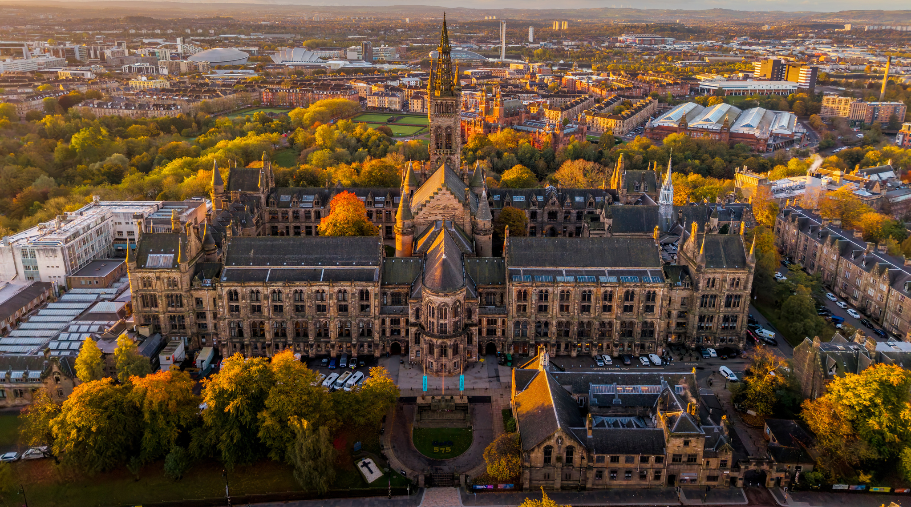
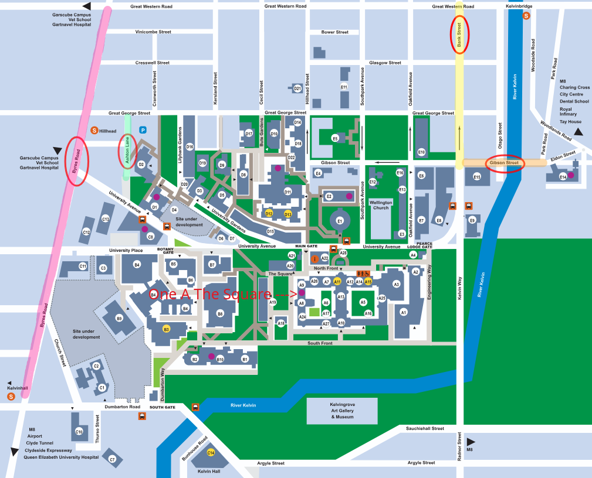

---

title: SPLV 2026
custom_css:
 - uog

---

# SPLV'26: Scottish Programming Languages and Verification Summer School 2026

## The University of Glasgow --- 3rd Aug to 7th Aug

The 2026 edition of SPLV will be held at the University of Glasgow, with the main courses running from within our stunning old campus building, the Gilbert Scott Building.

### Venue

The main courses will be held in <a href="https://maps.app.goo.gl/TS6aUZFpzN7k3YzY6">One A, The Square</a>, right next to the University Chapel.

A more detailed campus map is available <a href="assets/Campus-Map.pdf">here</a>.

## Accommodation

Students will be able to book discounted en-suite rooms at the <a href="https://maps.app.goo.gl/eRVwc5h41jU8k3VC8">Queen Margaret Residences</a>, a 25-mins walk away from campus. Price will be **£39/night**.

## Course Line-up

This year we have **4 invited core courses**, one of which whom is an external guest speaker, to be announced in early 2026. We also have 6 contributed courses that will be running in parallel tracks.

### Core Courses

__Introduction to Typed Functional Programming and the Lambda Calculus__ by [Nachi Valliappan](https://nachivpn.me/) (University of Edinburgh)

__Introduction to Model Checking__ by [Oana Andrei](https://www.gla.ac.uk/schools/computing/staff/oanaandrei/) (University of Glasgow)

__Introduction to Category Theory__ by [Bob Atkey](https://bentnib.org/) (Strathclyde University)

__[Surprise Talk]__ by [_Exciting Guest Speaker_]

### Contributed Talks

__Formal Modelling with Bigraphs__ by [Blair Archibald](https://www.blairarchibald.co.uk/) (University of Glasgow)

__Distributed Systems: A Logical Approach​__ by [Jamie Gabbay](https://gabbay.org.uk/) (Heriot-Watt University)

__Modal Fixpoint Logics__ by [Clemens Kupke](https://www.strath.ac.uk/staff/kupkeclemensdr/) (Strathclyde University)

__Algebra and Normalisation​__ by [Ohad Kammar](https://denotational.co.uk/) (University of Edinburgh)

__Resource-constrained compiler construction for functional languages__ by [Wim Vanderbauwhede](https://www.gla.ac.uk/schools/computing/staff/wimvanderbauwhede/) (University of Glasgow)

__Building Highly-Assured Compilers using Dependent Types​__ by [Jan de Muijnck-Hughes](https://tyde.systems/) (Strathclyde University)

## Target Audience

The school is aimed at PhD students in 
programming languages, verification and related areas. 
Researchers and practitioners are welcome, as are strong
undergraduate and masters students with the support of a supervisor. 
Participants should have a background in computer science,
mathematics or a related discipline.
Prospective students may contact the organisers if they have any concerns 
about background knowledge.

## Contact

You can reach the organisers at:

<glasgow-splv-organisers@lists.cent.gla.ac.uk>

The organisers of SPLV'26 are:

* Simon Fowler <Simon.Fowler@glasgow.ac.uk>
* Matthew Alan Le Brun <MatthewAlan.LeBrun@glasgow.ac.uk>
* Olivia Weston <o.weston.1@research.gla.ac.uk>
* Jacob Trevor <j.trevor.1@research.gla.ac.uk>
* Jeremy Singer <Jeremy.Singer@glasgow.ac.uk>

## Registration

Early registration is not yet open. Check back in March 2026. 

## Sponsors

### Gold Sponsors

