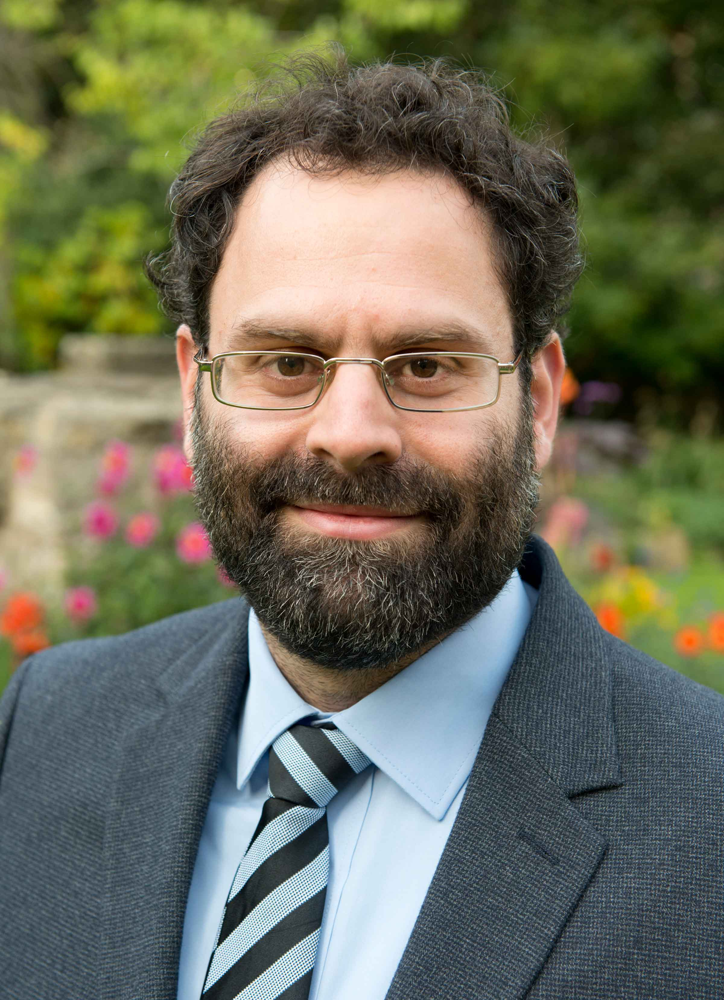
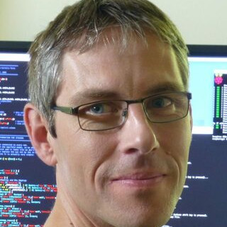
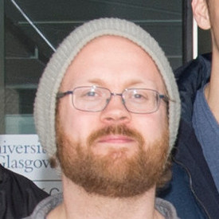

---

title: SPLV 2026
custom_css:
 - uog

---

# SPLV'26: Scottish Programming Languages and Verification Summer School 2026

## The University of Glasgow --- 3rd Aug to 7th Aug

The 2026 edition of SPLV will be held at the University of Glasgow, with the main courses running from within our stunning old campus building, the Gilbert Scott Building.

### Venue

The main courses will be held in <a href="https://maps.app.goo.gl/TS6aUZFpzN7k3YzY6">One A, The Square</a>, right next to the University Chapel.
A detailed campus map is available <a href="assets/Campus-Map.pdf">here</a>.

<!--  -->

## Registration and Accommodation

Registration is now open via [Eventbrite](https://www.eventbrite.co.uk/e/splv-2026-summer-school-tickets-1989312724911).

Registration is priced as:

  * Academic (early, registration deadline 30th June 2026): £260
  * Academic (late): £360
  * Standard (early, registration deadline 30th June 2026): £760
  * Standard (late): £860

This includes access to all sessions, catered lunch, social events, and a catered reception at Glasgow City Chambers.

We also have a limited amount of subsidised accommodation remaining at £195 for an en-suite room in 
[Queen Margaret Residences](https://www.gla.ac.uk/myglasgow/accommodation/visitorstouristsgroups/residences/queenmargaretresidences/),
checking in on Sunday 2nd August and checking out on Friday 7th August.
You can book this from the registration page.

## Course Line-up

This year we have **3 invited core courses**, and **6 contributed courses**.

### Core Courses

  
<strong>Introduction to Types and Lambdas</strong> by <a href="https://nachivpn.me/">Nachi Valliappan</a> (University of Edinburgh)

Types were introduced to me as a restriction bolted on top of the untyped lambda calculus to prevent runtime errors caused by "stuck" terms. Shackles I must program with, because I could not be trusted with the power of the unruly lambda calculus. In this course, I will present types via the alternative discipline of intrinsic typing, which internalizes types into the definition of a lambda calculus and terms are well-typed (thus free of said errors) by construction. Shackles that the programming language designer must design with, because I should not even be given the opportunity to make these errors. The objective of this course is to provide an introduction to intrinsically well-typed lambda calculi and their interpreters. We will cover the "full" simply typed lambda calculus and some extensions, along with well-typed interpreters of these calculi in a variety of syntactic and semantic domains.

 

  
<strong>Introduction to Model Checking with PRISM</strong> by <a href="https://www.gla.ac.uk/schools/computing/staff/oanaandrei/">Oana Andrei</a> (University of Glasgow)

Model checking is an automated technique for verifying whether a system satisfies its requirements by exploring all of its possible behaviours. In this tutorial we will learn how to model systems as transition systems, specify behavioural requirements using temporal logic, and use model checking to verify properties or generate counterexamples when they are violated. We will then explore these ideas in practice using the PRISM model checker, including a brief introduction to probabilistic model checking. Students are welcome to follow along using PRISM (https://prismmodelchecker.org) on their own laptops. This tutorial is suitable for beginners: no prior knowledge of model checking, formal verification or temporal logic is required.

 

  
<strong>Introduction to Category Theory</strong> by <a href="https://bentnib.org/">Bob Atkey</a> (University of Strathclyde)

Category Theory is a unifying language for describing mathematical structures and has been especially successful with the kinds of mathematical structures that arise in Computer Science. I will motivate the use of Category Theory in Programming Language and Verification research with some examples, covering the basic notions of category, functor, natural transformations, and universal properties.

 

### Contributed Courses

  
<strong>Formal Modelling with Bigraphs</strong> by <a href="https://www.blairarchibald.co.uk/">Blair Archibald</a> (University of Glasgow)

Bigraphs are a versatile modelling formalism, originally by Milner, that describes systems in terms of both spatial placement, e.g. a Person within a Room, and non-local linking, e.g. that Person connected via a radio link to a Cell Tower. 

In this tutorial we explore bigraphs through a practical lense: how do we specify a system with bigraphs, how are bigraphs combined, how do users specify their own rewrite rules (including probabilistic rules), and how can we use bigraphs once they are defined. Students are welcome to follow along using the [BigraphER tool](https://bitbucket.org/uog-bigraph/bigraph-tools). This tutorial is suitable for beginners:  No knowledge of category theory needed!

 

  
<strong>Distributed Systems: A Logical Approach</strong> by <a href="https://gabbay.org.uk/">Jamie Gabbay</a> (Heriot-Watt University)

An algorithm (= protocol) is distributed when it runs across multiple participants, without central control. A good distributed algorithm allows multiple participants to arrive at some common goal, even though there is no central controller, and even though some participants may not be following the protocol, e.g. they may have crashed, or be actively misbehaving.

Distributed protocols are usually specified as small (or not-so-small) imperative programs. In this course I will present an alternative declarative approach, based on logic. This is to traditional approaches as functional programming is to imperative programming: higher level of abstraction, shorter code, simpler proofs.

The rule of thumb is that declarative methods reduce complexity by a factor of 10 (10x shorter code; 10x shorter proofs). This means that a protocol that took 10 pages of specification and 100 pages of proof in imperative style, in declarative style takes 1 page of specification and 5-10 pages of proof. This is not a projection, it is from a real example.

My approach has been battle-tested on a proposed industrial protocol. It was studied using declarative methods and shown to be incorrect. Using the same declarative methods, the error was fixed. This fix involved nontrivial changes to the basic conceptual structure of the protocol, which were relatively straightforward to see in declarative style but were not evident in the imperative presentation.

In this course, I will give an overview of these methods, starting with simple protocols like Bracha Broadcast and Crusader Agreement, then moving to Paxos and, time permitting, the industrial protocol.

If you want to get a feel for the style of these techniques, you can look at the following resources:

<ol>
<li><strong>Bracha Broadcast / Crusader Agreement:</strong>
"Declarative distributed algorithms as axiomatic theories in three-valued modal logic over semitopologies" https://arxiv.org/pdf/2512.21137 (in press with Journal of Applied Logics).
A Lean formalisation of the proofs is at https://github.com/janmasrovira/mlda
</li>

<li>
<strong>Paxos:</strong>
"A declarative approach to specifying distributed algorithms using three-valued modal logic" https://arxiv.org/pdf/2502.00892 (submitted)
</li>

<li>
<strong>The industrial protocol:</strong>
"Heterogeneous trust in reliable broadcast via modal logic and history structures" https://zenodo.org/records/17636313 (submitted).
A Lean formalisation of the proofs is at https://doi.org/10.5281/zenodo.17611735
</li>
</ol>

For light reading see also:

<ol>
<li>"Decentralised collaborative action: cryptoeconomics in space" https://arxiv.org/pdf/2504.12493 </li>
<li>A toy model-checking tool, implementing many of these ideas, is at https://github.com/bellissimogiorno/declarative-protocols </li>
</ol>

 

  
<strong>Fixpoint Logics</strong> by <a href="https://www.strath.ac.uk/staff/kupkeclemensdr/">Clemens Kupke</a> (University of Strathclyde)

Modal Logics are used to reason about the finite behaviour of state-based dynamical systems. To be able to express properties of the ongoing, possibly infinite behaviour, one adds fixpoint operators to the logics. This class will explain the fundamentals of how this is done. The content is structured in the following three parts:  

(i) Intro to Modal and Temporal Logics 
(ii) Fixpoints and their Game characterisation 
(iii) A very brief intro to the modal mu calculus 

 

  
<strong>Algebra and Normalisation</strong> by <a href="https://denotational.co.uk/">Ohad Kammar</a> (University of Edinburgh)

Normalisation concerns specifying a representative in each equivalence
class. It comes up whenever we want to guarantee robustness up-to the
equivalence relation. For example, a normalising optimising compiler
will produce the same object code when you refactor your source code
using the equivalence it normalises by. Advanced type-checkers may
accept or reject programs by normalising fragments of their
types. Modern partial evaluators take incorporate equational laws
before extracting a residual program. The hallmark of modern algebra
is representation theorems: characterising a structure such as the set
of polynomials as the universal structure among a class of structures
of interest.

In this course, we will explore the relationship between normalisation
and modern algebra. We will start with algebraic expressions and
universal algebra, and relate them to normalisation and partial
evaluation using multi-sorted equational logic. In the second part of
the course, we will turn to normalisation of open-programs through the
more advanced second-order algebraic structures.

[Course web-page](https://denotational.co.uk/algebra-and-normalisation-splv-2026/)

 

  
<strong>Resource-constrained compiler construction for functional languages</strong> by <a href="https://www.gla.ac.uk/schools/computing/staff/wimvanderbauwhede/">Wim Vanderbauwhede</a> (University of Glasgow)

In this course we explain how to create a compiler for an expressive statically typed functional language targeting a resource-constrained VM (16K memory, 8-bit instructions) and what the challenges are in doing so. As ultimately the compiler should be able to run on the same VM, it has to be constructed in a resource-constrained way.

The course will deal with the architectural and design choices. I will assume attendants have some knowledge of statically typed functional programming (Haskell, ML) with a Hindley-Milner-like type system, but I do not assume knowledge of compilers. 

The main blocks are:

<ul>
<li> The target language, Funktal, an expressive statically typed functional language,  and its design choices</li>
<li> The target platform for the language, the Uxn VM, and its assembly language Uxntal</li>
<li> High-level view of a compiler</li>
<li> How to create a resource-constrained compiler: principles, techniques, structure and design </li>
</ul>

 

  
<strong>Building Highly-Assured Compilers using Dependent Types</strong> by <a href="https://tyde.systems/">Jan de Muijnck-Hughes</a> (University of Strathclyde)

Traditionally, designing our programming languages has been a
pen-&-paper (LaTeX) exercise to describe syntax, semantics, and proofs
that important properties hold.
These designs must then be realised in software.
However, writing software is challenging and errors will be made.
Mechanisation offers a way to reduce design and implementation mistakes
by making them both machine checkable.

This course provides an introduction to mechanised programming language
design using dependent types.
We will also explore how the same mechanised proofs lay the foundation
for a verified pipeline for type-checking and executing programs.

No prior experience with dependently-typed programming is required;
ample reference material will be provided!

 

## Target Audience

The school is aimed at PhD students in 
programming languages, verification and related areas. 
Researchers and practitioners are welcome, as are strong
undergraduate and masters students with the support of a supervisor. 
Participants should have a background in computer science,
mathematics or a related discipline.
Prospective students may contact the organisers if they have any concerns 
about background knowledge.

## Contact

You can reach the organisers at:

<glasgow-splv-organisers@lists.cent.gla.ac.uk>

The organisers of SPLV'26 are:

* Simon Fowler <Simon.Fowler@glasgow.ac.uk>
* Matthew Alan Le Brun <MatthewAlan.LeBrun@glasgow.ac.uk>
* Olivia Weston <o.weston.1@research.gla.ac.uk>
* Jacob Trevor <j.trevor.1@research.gla.ac.uk>
* Jeremy Singer <Jeremy.Singer@glasgow.ac.uk>

## Sponsors

### Gold Sponsors

### Silver Sponsors

### Bronze Sponsors

<!-- Style -->

