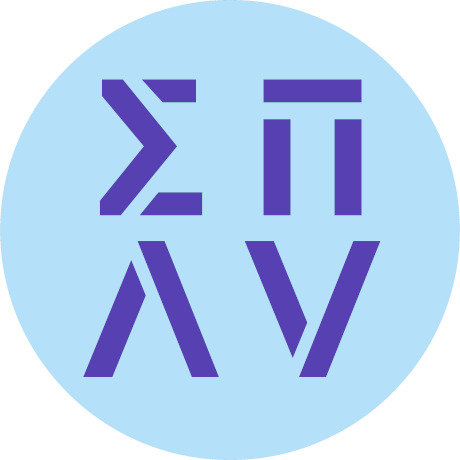

# Scottish Programming Languages and Verification Summer School

The Scottish Programming Languages and Verification Summer School
is a collaborative effort between the Universities of Edinburgh,
Glasgow, Heriot-Watt, Strathclyde and St Andrews. This summer school
provides core and advanced classes that cover foundational as well
as state of the art knowledge on the underlying principles needed
to use or design new languages and verifying program correctness.

This school aims to:

* Facilitate rapid knowledge exchange, in addition to providing
  essential research training and networking for postgraduate students.

* Give postgraduate students the opportunity to network with fellow
  students in the field as well as many established researchers.

* Provide essential postgraduate training in theoretical underpinnings
  of computer science and in programming languages

# Code of Conduct

From 2024 onward,
all SPLV events and activities operate under the [following Code of Conduct](CODE-OF-CONDUCT).

# Current and Previous Summer Schools:

## Current Edition

* [2024 edition in Strathclyde](2024-strathclyde)

## Past Editions

* [2023 edition in St Andrews](2023-st-andrews)
* [2022 edition in Heriot-Watt](https://www.macs.hw.ac.uk/splv/splv-2022/)
* [2021 edition in (virtual) Glasgow](https://www.macs.hw.ac.uk/splv/splv-2021/)
* [2020 edition in (virtual) Edinburgh](https://www.macs.hw.ac.uk/splv/splv20/)
* [2019 edition in Strathclyde](https://www.macs.hw.ac.uk/splv/splv19/)

# Steering committee:

* Ekaterina Komendantskaya (Heriot-Watt University)
* Clemens Kupke (University of Strathclyde)
* Susmit Sarkar (University of St Andrews)
* Jeremy Singer (University of Glasgow)
* James Cheney (University of Edinburgh)
* Ohad Kammar (University of Edinburgh)

## General publicity chair:

* Alasdair Hill (Heriot-Watt University)
